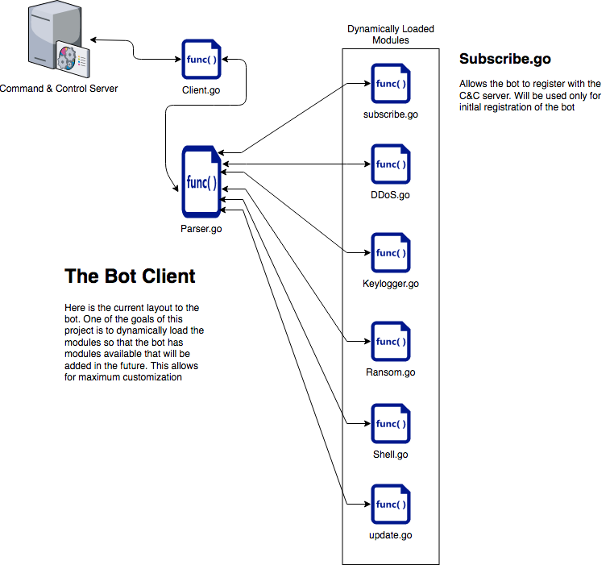
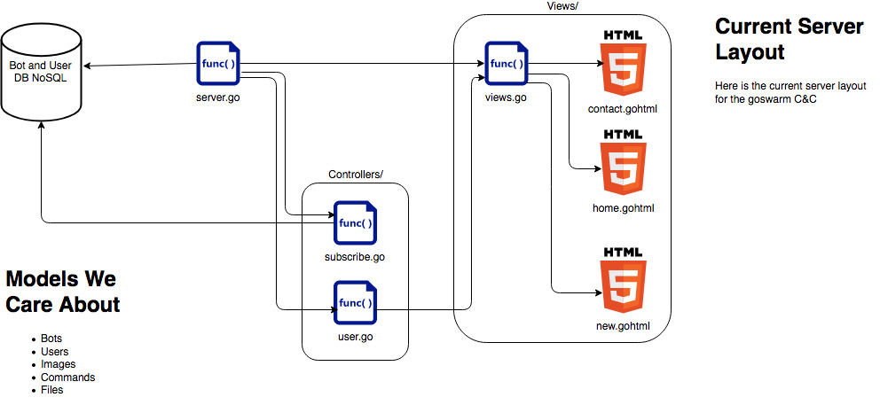

# Botnet-POC
Botnet client that currently uses twitter as its C&C channel. 

## The Client

The botnet client will be a modular bot that allows for access to any machine no matter what the OS. The purpose of using Go is so that we don't have to deal with any dependencies and its cross platform. It will be designed so that modules can be added on the fly and potentially even a self upgrading feature so the bots can be updated.

### Features:
- Each bot will have a GUID for identification 
- modular design
- keylogging
- DDoS
- Ransomware
- reverse shells
- persistence mechanisms
- system information
- data exfiltration
- screenshot
- download and run executable
- potentially process injection

## The Server

We started this project with just using twitter as a C&C but we quickly scrapped this idea but its not very flexible and allows no interaction with the bots. The server will be completely written in Go to stick with the theme. 

### Features:
- SQL database
- login-system
- Single, Selected, All Command Issuing

## Running the Bot

`go run client.go`

## Running the Server

I have been using `fresh`` to dynamically reload the server as it updates so all thats required is entering `fresh` in the Server directory. 

`fresh`

The server will bind to localhost on port 3000. To test this out go to your browser and enter 127.0.0.1:3000 and you should be directed to the home page of the webapp. 

## Architecture Design Of The Bot

## Architecture Design Of The Server

## Authors
- Pim Trouerbach
